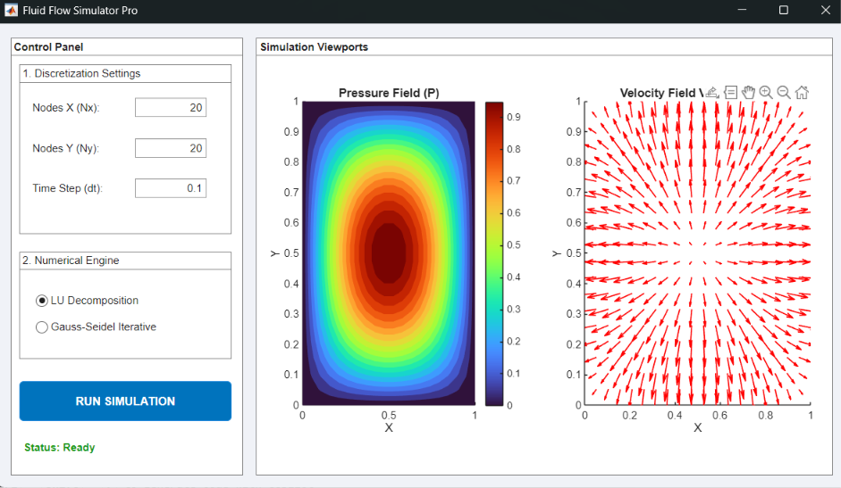

# Fluid Flow Simulator Pro (MATLAB)

An interactive, lightweight 2D Potential Flow and Pressure Field solver built purely in native MATLAB OOP.

 
## Overview
Modeling fluid mechanics via the full Navier-Stokes equations from scratch often results in numerical explosion due to non-linear convective acceleration terms. This application solves the fundamental **Pressure-Poisson Equation** ($\nabla^2 P = b$), which acts as the mandatory "Pressure Correction" step in advanced computational fluid dynamics (CFD) algorithms like **SIMPLE** and **MAC**. 

By calculating the steady-state pressure field across a user-defined grid, the simulation recovers the 2D velocity vector field via momentum gradient descent.

## Mathematical Formulation

### 1. The Governing Equation
We solve the 2D Poisson equation for pressure $P(x,y)$:

$$\frac{\partial^2 P}{\partial x^2} + \frac{\partial^2 P}{\partial y^2} = b(x,y)$$

Where the synthetic source term driving the flow is defined as:
$$b(x,y) = -2\pi^2 \sin(\pi x) \sin(\pi y) $$

### 2. Discretization (The 5-Point Stencil)
Using second-order central finite differences over step sizes $\Delta x$ and $\Delta y$, the continuous Laplacian is mapped to a system of linear algebraic equations ($A \cdot P = b$):

$$P_{i,j} \left( \frac{-2}{\Delta x^2} + \frac{-2}{\Delta y^2} \right) + \frac{P_{i+1,j} + P_{i-1,j}}{\Delta x^2} + \frac{P_{i,j+1} + P_{i,j-1}}{\Delta y^2} = b_{i,j}$$

### 3. Velocity Recovery
Velocity vectors $\vec{V} = (u, v)$ are recovered from the spatial pressure gradient scaled by the stepping parameter $dt$:

$$u = -dt \frac{\partial P}{\partial x}, \quad v = -dt \frac{\partial P}{\partial y}$$

---

## Features

* **Dual Numerical Engines:** Switch instantly between a **Direct Solver** (LU Decomposition) and an **Iterative Solver** (Gauss-Seidel) to observe trade-offs in memory vs. convergence speed.
* **Asymptotic Sparse Assembly:** The coefficient matrix $A$ is pre-allocated as a MATLAB `sparse()` data type. This allows the app to solve thousands of simultaneous equations instantly without triggering MATLAB memory limits.
* **Strictly Bound Dirichlet Walls:** Outer boundary nodes are locked to $P = 0$, guaranteeing a well-posed matrix that cannot become singular.
* **Zero Dependencies:** Written entirely in Vanilla MATLAB. Requires no extra Toolboxes (e.g., no PDE Toolbox or CFD Toolbox needed).

---

## Installation & Usage

1. Clone this repository or download `FluidFlowSimulatorApp.m`.
2. Open MATLAB and navigate to the directory containing the file.
3. In the MATLAB Command Window, instantiate the application:

   ```matlab
   FluidFlowSimulatorApp

## Contributors


| Name | GitHub |
| --- | --- |
| Prakhar Gupta | [@PrakharG8651](https://github.com/PrakharG8651) |
| Arun Chauhan | [@Arun-Chauhan-24](https://github.com/Arun-Chauhan-24) |
| Prince Meena | [@xenoz27](https://github.com/xenoz27) |
| Aman Agrawal | [@Amanag185](https://github.com/Amanag185) |
| Aadi Chhajed | [@Aadi-Chhajed](https://github.com/Aadi-Chhajed) |
| Rajinder Majoka | [@raman9728152450](https://github.com/raman9728152450) |
| Abhishek Parth | [@Abhishek-Parth](https://github.com/Abhishek-Parth) |
